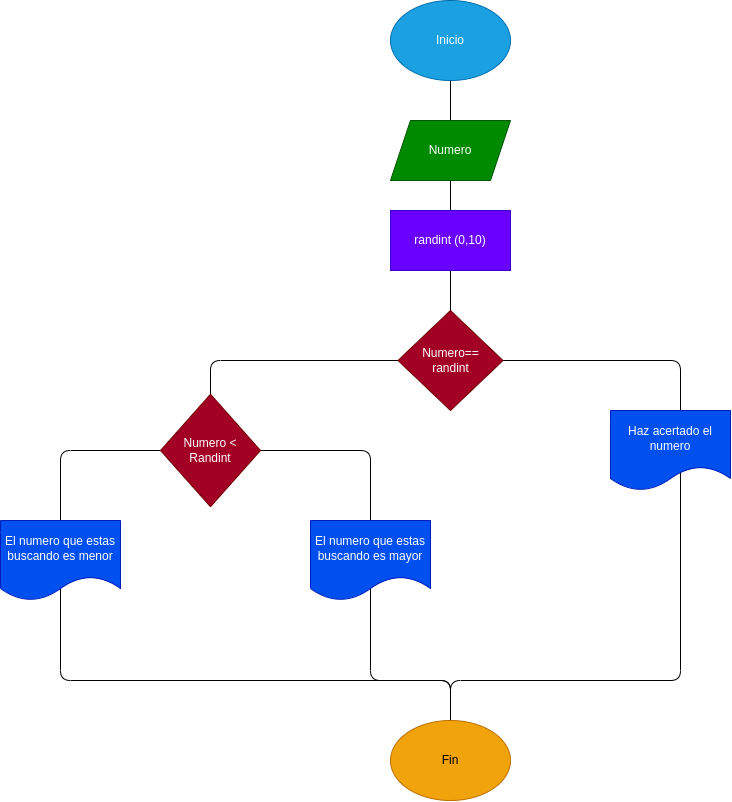

# Adivina-el-numero

Programa que genera un numero al azar para que la persona que lo ejecute lo adivine

# ANALISIS

Variables de entrada y proceso (input, processing)

Numero= Numero dado para comparar con el numero generado al azar
X =  Numero generado al azar

Variables de salida

Numero igual al numero generado
Numero menor al numero generado
Numero mayor al numero generado

Nos indicara al final si el numero que dimos coincide al numero generado al azar

# DISEÑO

# CONSTRUCCION
